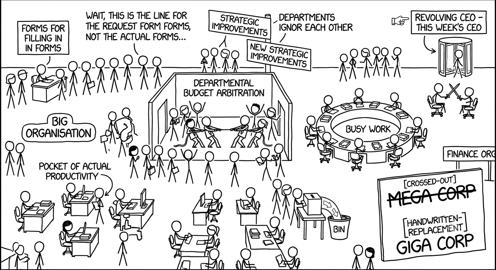
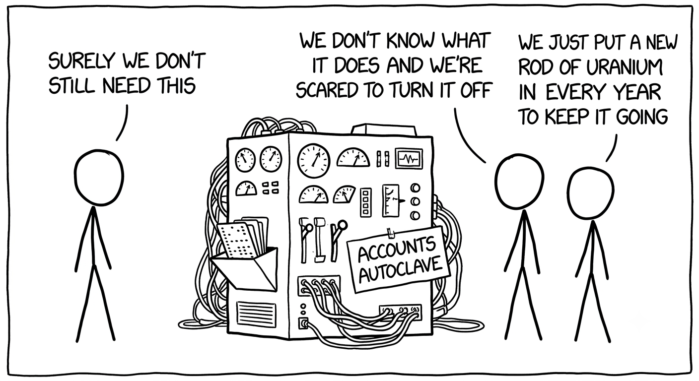
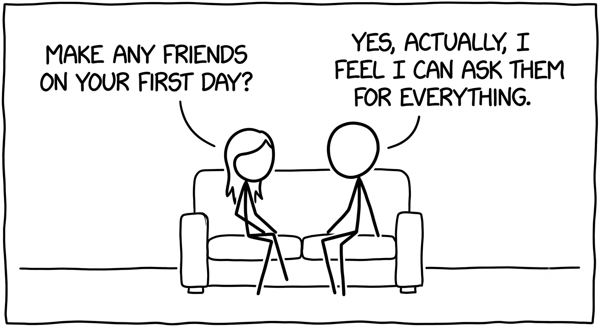
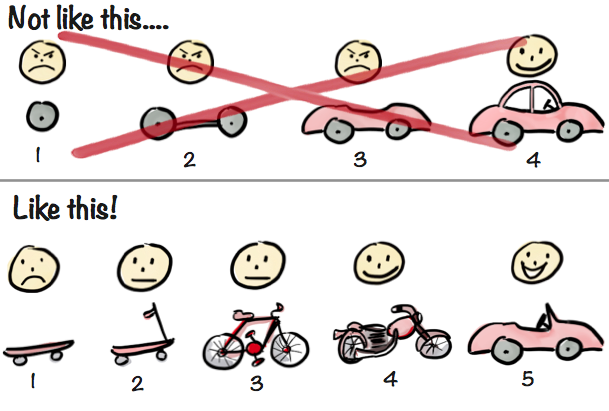
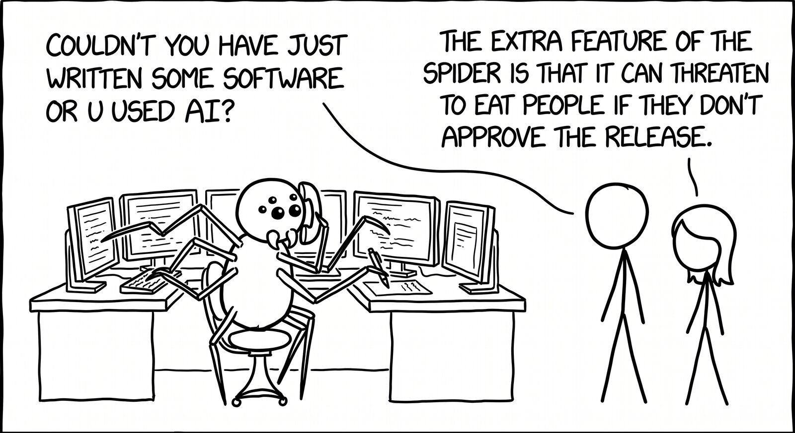

# Surviving and Thriving in Big Organisations

Joining Big Org is overwhelming. There is so much complexity in front of you - some of it necessary, some of it entirely accidental. There will likely be multiple regulators for your industry placing restrictions on what you must and must not do, with the cost of failure extremely high. As an engineer you have to learn the business domain and the IT domain at the same time. Expect weirdness, inefficiency, frustration, politics and bureaucracy.

None of that is going away because you turned up. So the real question is: what can you actually do about it?

This is a survival guide. Not a manifesto for fixing Big Org - nobody fixes Big Org - but a set of things you can reframe, things you can stop worrying about and things you can actually change, so your time there is productive, tolerable an even enjoyable.

## A brief history of Big Org

> None of this is personal - it's the predictable result of scale

Every business starts small and focused, and the successful ones survive and grow. Big Org didn't get big just by growing organically but through many mergers and acquisitions of competitors, adjacent businesses, whole product lines, with each one bringing confusion, complexity and a dilution of purpose. Once it gets big enough a second cycle emerges: centralisation of functions to save on overhead, followed by decentralisation when the centralised functions can't keep everyone happy. Each cycle leaves a trail of carnage and a not-quite-dead centralised function behind.

Weirdness follows. It's a function of size and complexity that simply outscales individuals by multiple orders of magnitude. Some things you'll see on the way to acquiring your thousand-yard stare:

- Politics, bureaucracy, inefficiency
- Byzantine processes
- Centralised teams hidden behind opaque ticket queues
- Conflicting requirements, sometimes for good reasons like regulation, sometimes because changing software is easier (not simpler) than changing the business
- Missing requirements and higher churn, because it's impossible to know everything up front
- One size fits all, like it or not
- Incentives for the wrong behaviour, like rewarding how fast you close a ticket without measuring if it was closed satisfactorily
- Uncodified institutional knowledge - wisdom of the ancients: "we've always done it that way"
- Spreadsheets for everything
- Documentation that's outdated the moment it's written
- Systems that will run until the heat death of the universe because we don't know what they do and we're scared to switch them off
- Budgets that won't let you hire people but will let you spend incredible amounts on IBM or Oracle

If these things are going to drive you insane, Big Org might not be for you. This is worth considering seriously, because I have seen it happen multiple times: someone joins Big Org, gets frustrated and leaves six months later, which is disruptive to them and the team they joined. Some people thrive on the opportunity to make change at scale. If this might be you, keep reading for some advice and tools which may help you face the challenge.

## Your first day

> Build your mental model

Prepare to fill in some request forms. Lots of them. I tell people that the request form application is their new best friend.

You will be bombarded with information. New people, acronyms, systems with strange names, intricate processes, long email chains. Absorbing as much as you can, as fast as you can, is your first job. Everyone's brain works differently, but I draw diagrams - lots of them, sometimes covering the same ground from different perspectives: who belongs to which team, what a given system is for, the journey of a single quote through the systems, the desks that touch it, where a piece of data actually lives, what a trader uses versus what a salesperson uses.

Each diagram builds a different facet of your mental model, and each one is something you can discuss with someone else. Show a colleague your diagram and ask "so where does what you just told me fit on this?" - it shows them exactly what you know, so they can tell you precisely instead of re-explaining from scratch, and correct any wrong assumptions you made.

It's ok to not understand and you shouldn't be afraid to say so - tell people you're new up front and they will be patient with you. The one thing worth avoiding is asking the exact same question twice, because it looks like you haven't listened. Writing things down and drawing them makes that avoidable, and if you do need to revisit something, show you have been listening: "you told me we always do X, but it only seems to apply in a minority of cases - so why do X the rest of the time?"

You get a honeymoon period too. Nobody expects your contributions to break even before about three months, and you might not make a significant net contribution before six. That doesn't mean you have nothing to offer; on the contrary, your fresh perspective, ideas and questions are something you have that no one else does and are valuable to your new colleagues.

Your mental model is never complete; your responsibilities will grow, and the world does not stand still. You should continually work on refining and updating your mental model.

## How to make a difference

> Choose carefully and convince the business in their own language

We're usually engaged to bring expertise, both technical and domain, to a client's problem along with a team of skilled engineers who can help deliver a solution.

Our extra value as a consultancy is to look around while we're doing that and see how else we can help. It might be pain that we have during implementation, or opportunities we see to improve delivery. You can't fix everything, so choose your challenge wisely. Consider how long something takes to do versus how frequently it's performed - shaving a few seconds off a small-but-frequent task is as valuable as saving a day from something you do once a month. Time saved can add up quickly over days and weeks, multiplied across teams: on a team of 6, saving each person 3 minutes per hour gives you an extra 2 person days per week. Wouldn't that be useful?

*"Automation" by [xkcd](https://xkcd.com/1319/), used under [CC BY-NC 2.5](https://creativecommons.org/licenses/by-nc/2.5/)*

### Small differences

For a developer the small-but-frequent tasks are things like the code-test-refactor loop that we do hundreds of times a day. Optimisations include improving your typing speed and accuracy, the responsiveness and performance of the hardware, the IDE and tooling you use. Sadly, even these basic things cannot be taken for granted because you are often given a general-purpose Windows machine, laden with endpoint security, to use for development alongside email, chat apps and (inevitably) Excel. I've found that within these environments a Linux machine will give you vastly better performance, more native tooling and the possibility of faster hardware (if it's a VM in the cloud). Finding and getting hold of one may not be easy, but worth fighting for.

Excel wasn't a joke, by the way. An axiom of Big Org: everything ends up in a spreadsheet eventually, no matter what you build or how good your UI is. Don't fight it - if your application doesn't ship with a spreadsheet import and export it's guaranteed that someone, quite possibly you, will find themselves copying a load of data cell by cell.

### Big differences

I spent a year building an alternative to a home-grown legacy ecosystem - old Python, a mega-monorepo that was chronically broken, an unfathomable version control system, a gnomic runtime scheduler - despite modern tooling already in use elsewhere in the organisation. There was so much inertia: sunk costs, urgent business deliveries, the local maximum paradox. They were struggling to release working software, with a spiralling release cadence, ever more bugs, and months to deliver features.

A new tech stack isn't going to help with the business aims, is it? Actually yes, it will - but you have to communicate the bigger picture framed in a way the business can understand. They don't care if you use git or containers, but they do care about more frequent releases, lower lead time for features and fewer bugs. We sent out a monthly newsletter of business success stories: "Feature X requested on Wednesday, in production on Friday". The client didn't ask for this, but the need for it was obvious. The fresh perspective we had gave us conviction there was a better way.

The approach we championed was a service-oriented architecture built on standard infrastructure and tooling, with services encapsulating behaviour behind stable interfaces. This made testing much more automatable and reliable, allowed services to move at different speeds and gave us smaller releasable units. That allowed us to increase release cadence and deliver features faster. Furthermore, it had benefits for hiring - new joiners have more transferable skills, and it will be easier to find candidates.

The benefits of faster release cycles compound as well: slow release cycles push users to ask for more flexible features, because they don't want to wait months for a change - which makes each feature bigger, slower and more complicated, lengthening the cycle further still. Fast cycles break that spiral: ship something simple, adjust it days later if needed.

### Visible delivery

Visible delivery matters as much as fast delivery. I once worked on a project building a pricing platform for structured products, taking over from another consultancy that had used six months of the one-year timeline not delivering much. My team of three delivered a basic demo within two weeks, showed something akin to an MVP within six, and had regular demos before meeting the original production release date despite half the time lost before we even started. The business had lost confidence in tech delivery; small, visible increments helped build trust in our new team.

I had a colleague who would share this image at every opportunity. I still find it useful today, along with the mantra "Make it work, make it right, make it fast". They are both useful reminders for everyone that every long journey starts with the first step.

*Illustration by [Henrik Kniberg](https://blog.crisp.se/author/henrikkniberg)*

### Sustainability

Speaking of long journeys, your speed needs to be sustainable. The system on the legacy stack I described earlier didn't start out that way. How can we avoid a descent into entropy?

**Technical debt** is never given the respect it deserves; the business features are always more important. This works fine until the delivery grinds to a halt because the drag from tech debt has consumed all developer output. I believe the IT team have a responsibility to communicate the cost of technical debt and should discuss it openly with the business, but also retain ownership over addressing it. This is usually done in two ways: a small tax on every change or a big work item. Personally I prefer the former; it's easier for the business to budget for and you can land your changes more cleanly if you've done a nice prefactor to tidy up all the code that you're about to touch. Big work items are sometimes necessary, and should be balanced - devote one developer to it, and have the rest keeping the business happy rather than stopping the entire line.

**Clear responsibilities** for each application. A system may need very complex behaviour, but that doesn't mean you can't compose it from simpler components which can be developed faster, released with more confidence, and fit inside a developer's head. Often the excuse of it being too hard to make a new application is used to just bundle it with something else, multiplying the complexity and vastly complicating any later extraction. If this is the case, invest in the ability to make new applications - templates, shared libraries, recipes for onboarding and integrating. It will only get harder as time goes on to pull out anything meaningful from the spaghetti you're otherwise making.

**Clean interfaces** will ensure that each application and system doesn't get entangled with others, retaining their ability to change and be released independently. Highly coupled components have to be changed and released together, leading to delays and a higher possibility of bugs. These interfaces also provide great places to hook in observability, test and automation tools. I've seen entire systems driven through Selenium tests on a single UI, where the majority of the time and flakiness comes from simply setting up the preconditions and the assertions are weak because the outcome is not properly surfaced in the UI.

**Automation** of all the things. Some of the most valuable automation in Big Org isn't technical, it's bureaucratic. At one bank, releasing anything meant lining up five paperwork systems, with a minimum of five working days lead time. Doing a release wasn't just a task; it was a Herculean effort (I'd argue it was Sisyphean, since Hercules only had to do his labours once). Multiple people's entire jobs were just farming the release process, and when two of them left some of that job landed on developers including me. My first attempt took four days. I was trying to do weekly releases and remain a developer, and this clearly was a blocker, so I did the developer thing and automated it: an app to track releases, drive jiras, prefill email templates for the steps needing a human, generate wiki pages and fill in forms with Playwright driving a browser. It took a fair amount of effort, but I got the work down to about 20 minutes and it scaled across multiple applications and teams. It strangely became the thing I was best known for, even though it was just a tool I needed to do my main job in a reasonable way.

None of these things are easy or quick. They take time and dedication, so pick your battles, have a clear idea of what you want and why you want it, get the business onside and then see it through.

## AI

> Double down on your mental model

AI deserves its own section because it's undoubtedly the biggest change the software industry has ever seen. It's strange, because new technology in Big Org normally moves bottom-up against resistance - developers use something outside work, see the advantage, then have to fight the policy to bring it in where the default answer is always no. AI is the opposite: enforced from the top whether people wanted it or not. I suspect it's a mix of fear of being left behind by their competitors and everyday exposure to AI, where the results of vibecoding a simple app get taken on faith as extending cleanly to the complex systems inside a Big Org. In these systems, as a colleague told me, "typing was never the bottleneck" - it's thinking and mental models, both which remain as your advantage over ever more capable agents. 
None of these organisations are clear on how much value they're getting from AI, but I bet they know exactly how much it costs. When this eventually self-corrects I think we'll see a shift in usage. Until then, use the time wisely to learn the tools and experiment.

Although I personally find AI to multiply my output quite effectively, I struggle with detachment from the code. I don't have all the answers, and I don't think you should believe anyone who says they do. My solution is to double down on my mental model - it has always been my tool to think of the tens of thousands of lines of code that humans wrote, and extends to the hundreds of thousands that AIs will write.

## The survival toolkit

**Emails** will attempt to drown you. Invest time in email filters to find the signal in the noise and make the best use of your time.

**Meetings** abound. If a meeting doesn't need your input and its output doesn't affect you, politely remove yourself. If a meeting invites your whole team but only requires a representative, send one person who reports back.

**Prepare** for meetings, too. In the land of opinions, the person with hard facts (and diagrams) is king.

**Empathy** with the people you interact with. What motivates them? What frustrates them? This will help you understand what they want from you.

**Seek first to understand, then to be understood** because no one knows everything, including you.

**Failures will happen** but what really matters is that you do what you can to avoid, mitigate and prevent them recurring.

**Don't boil the ocean** because Big Org's to-do list is infinite and trying will burn you out. Focus on the highest-impact things you can achieve.

**Automate** what you can, not just for your own convenience, but so the knowledge becomes codified and the process becomes scalable.

## Leave it better than you found it

None of this fixes Big Org. Nothing will, and that's fine - it isn't your job to fix it single-handedly and you shouldn't try. What you can do is build your own mental model and share it generously, automate the things that grind people down, choose one or two things to make a really positive change to, and leave everything you touch a little better than you found it.

Do that consistently enough, and you won't just survive Big Org - you'll actually be glad you were there.
